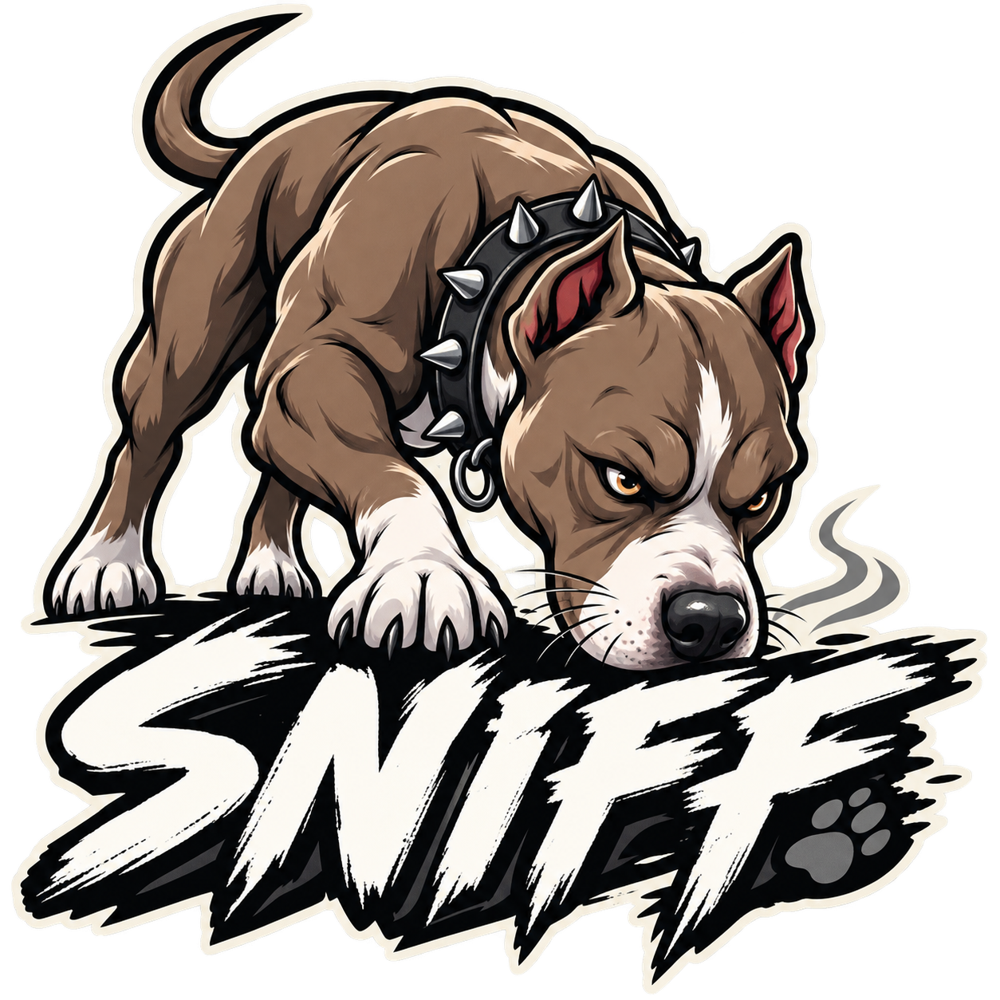

# sniff



Do you want your Janet program to look at configuration files, the
environment, and the command line to get its options, without
having to *code* any of that stuff? Feel bogged down writing the
same old I/O code for every program?

Then sniff is for you!

sniff gathers a program's options into a single table — an
"options tower" — from, in increasing order of precedence:

1. The system-wide configuration file.
2. The per-user configuration file.
3. The project configuration file (`<cwd>/<program>.nrdl`).
4. Environment variables (`<PROGRAM>_<option>`).
5. The command line (`--set-<option>`).

Each source overwrites the sources below it, so a command-line
option beats an environment variable, which beats any
configuration file.

## Platforms

sniff runs on Linux, macOS, and Windows, and searches a
platform-appropriate set of files:

- **System-wide configuration file** — `/etc/<program>/config.nrdl`
  on Linux, `/Library/Preferences/<program>/config.nrdl` on
  macOS, and `C:\ProgramData\<program>\config.nrdl` on Windows.
- **Per-user configuration file** — `$XDG_CONFIG_HOME/<program>/config.nrdl`
  (or `~/.config/<program>/config.nrdl`) on Linux,
  `~/Library/Preferences/<program>/config.nrdl` on macOS, and
  `%LOCALAPPDATA%\<program>\config.nrdl` on Windows.
- **Project configuration file** — `<cwd>/<program>.nrdl`, in the
  current working directory, on every platform.

Only files that exist are read, so a fresh program with no
configuration anywhere just gets its defaults.

## Everything is NRDL

Every option value — in configuration files, in environment
variables, and on the command line — is parsed as a
[NRDL](https://github.com/djha-skin/nrdl) (Nestable Readable
Document Language) document, a JSON superset. Options arrive
already typed, no matter which source set them:

```text
GOOSE_LOUD=true            # a boolean
GOOSE_NAME="Fern"          # a string
--set-port 8080            # a number
--set-region us-east-1     # a keyword
{ workers 4 }              # a whole table, from any source
```

If you can write it in NRDL, you can set it from any source.
sniff is a Janet port of the Common Lisp
[CLIFF](https://github.com/djha-skin/cliff) library, simplified to
gather options without declaring or validating them.

## Use it

```janet
(import sniff)

(defn main [& args]
  (def [options arguments]
    (sniff/load-options
      "my-program"
      {"-h" ["--set-help" "true"]
       "-p" ["--set-port"]}
      args))
  ...)
```

## Get it

Add sniff to your project's `:dependencies` in `project.janet`
and run `jpm -l deps`:

```janet
{:url "https://github.com/djha-skin/sniff"}
```

## Documentation

Documentation including installation, a quickstart, a longer
worked example, and the API reference can be found
[here](https://djha-skin.github.io/sniff).
